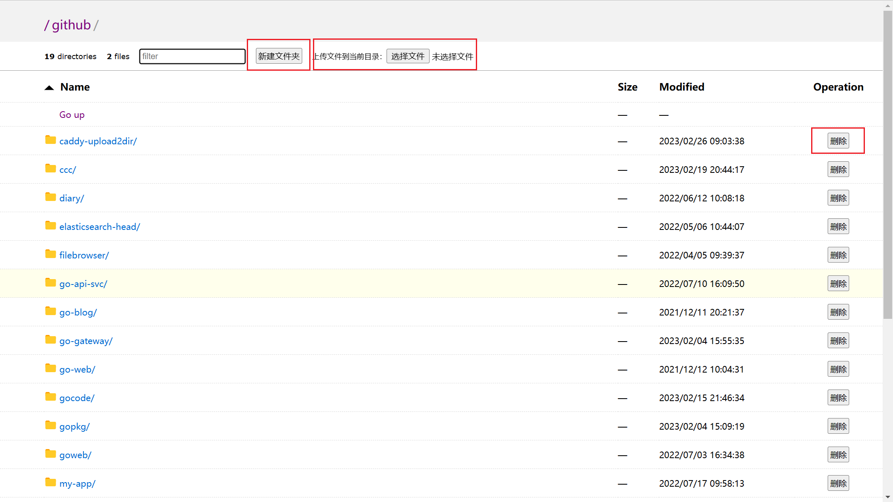
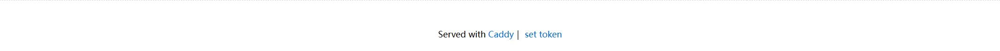

## Requirement
- [Go Installed](https://golang.org/doc/install)

## Install
refer to [Extending Caddy](https://caddyserver.com/docs/extending-caddy)
1. **Install [xcaddy](https://github.com/caddyserver/xcaddy)**

```sh
go install github.com/caddyserver/xcaddy/cmd/xcaddy@latest
```

2. **Build A New Caddy Binary**

```sh
xcaddy build master --with=github.com/crackeer/caddy-upload2dir
```

3. **copy new template.html**

here is the [template.html](https://github.com/crackeer/caddy-upload2dir/blob/main/template.html)

## Example:caddy.json
apps.http.servers下的一个配置
```json
{

    "static": {
        "idle_timeout": 30000000000,
        "listen": [
            "0.0.0.0:80"
        ],
        "max_header_bytes": 10240000,
        "read_header_timeout": 10000000000,
        "routes": [
            {
                "match" : [
                    {
                        "method" : ["POST", "PUT", "DELETE"]
                    }
                ],
                "handle" : [
                    {
                        "handler" : "upload2dir",
                        "file_server_root" : "/your/file/dir",
                        "user_config" : [
                            "token:user_name:create_dir/delete_file/put_file"
                        ],
                        "user_token_cookie_key" : "token"
                    }
                ],
                "terminal" : true
            },
            {
                "handle": [
                    {
                        "handler": "file_server",
                        "root": "/your/file/dir",
                        "browse": {
                            "template_file": "/new/template.html"
                        },
                        "index_names" : [""]
                    }
                ]
            }
        ]
    }
}
```

#### about user_config
`token`:`username`:`create_dir`/`put_file`/`delete_file`
There are three actions you can config in user_config
- create_dir
- put_file
- delete_file

## what new filer_server page looks like?
- Add create directory in current directory、upload file to current directory、delete file or empty directory


**attention!!!** 
you have to set your token which represents your identity that make you have access to the three actions, you can click `set token` at the bottom of the page.



